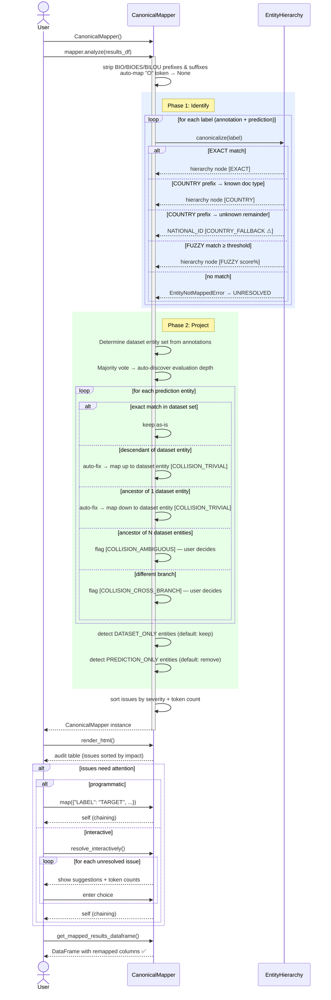

# PRD: Entity Mapping Workflow

## Introduction

Users of Presidio Evaluator bring their own entity label vocabularies — from custom datasets, fine-tuned models, or
third-party tools. Before evaluation can happen, every user-defined label must be resolved to a common vocabulary so
that dataset annotations and model predictions can be compared on equal footing.

The core use case is **comparing multiple models against the same dataset**. The dataset defines the evaluation
contract — its entity vocabulary is the ground truth. Models are the variable; the dataset is the constant.

This feature provides a single, stateful class — `CanonicalMapper` — that resolves labels in two phases:

1. **Identify** — locate each raw label in the `EntityHierarchy` taxonomy (exact alias, country-prefix, fuzzy).
2. **Project** — map prediction labels onto the dataset's entity set, using hierarchy relationships to bridge
   granularity gaps. Trivial collisions (ancestor/descendant on the same branch) are auto-fixed.

The workflow:

1. Construct `CanonicalMapper()` and call `mapper.analyze(results_df)` — discovers labels from the DataFrame,
   auto-discovers the evaluation depth via majority vote of dataset annotation depths, identifies all labels
   in the hierarchy, and projects predictions onto the dataset's entity set.
2. Inspect `mapper.get_issues()` — issues sorted by severity then affected token count (most impactful first).
3. Handle issues via `mapper.map({...})` (programmatic) or `mapper.resolve_interactively()` (terminal/notebook).
4. Call `mapper.get_mapped_results_dataframe()` — returns the DataFrame with remapped columns.

The workflow is a pure Python API (no UI). Interactive prompting is done in the terminal (usable in notebooks or CLI),
and can be bypassed entirely by calling `map()` with pre-built assignments.

---

## Workflow Diagram



---

## Goals

- **Dataset-anchored mapping** — the dataset's entity vocabulary is the evaluation contract. Prediction
  entities are projected onto it, not onto an abstract canonical depth.
- **Auto-discover evaluation depth** — use majority vote of dataset annotation depths instead of requiring
  a `canonical_depth` parameter upfront.
- **Automatically resolve trivial collisions** — ancestor/descendant mismatches on the same hierarchy branch
  are auto-fixed and flagged (not silent).
- **Frequency-based issue triage** — surface the most impactful problems first (by affected token count).
- **Sensible defaults** — prediction-only entities are suppressed (default: remove); dataset-only entities
  are kept (default: keep). Both are overridable.
- **Surface unresolvable labels clearly**, with ranked fuzzy suggestions to make manual mapping fast.
- **Return a reusable mapped DataFrame** that downstream evaluation code can consume.
- Allow the caller to drive mapping **programmatically** (batch mode) or **interactively** (terminal/notebook).
- **Log every resolution decision** so users understand what happened without inspecting internal state.
- Replace the previous semantic-similarity-based mapping approach entirely. All entity resolution goes
  through `EntityHierarchy` canonicalization — no sentence embeddings, no external ML dependencies.

---

## User Stories

### US-001: Auto-discover evaluation depth from dataset
**Description:** As a user, I want the mapper to automatically determine the right evaluation depth from my dataset's annotations so I don't have to guess a `canonical_depth` parameter.

**Acceptance Criteria:**
- [ ] After `analyze(results_df)`, the mapper determines the hierarchy depth of each annotation entity.
- [ ] The majority-vote depth becomes the default evaluation depth.
- [ ] Annotation entities at outlier depths are handled by the projection step (not silently dropped).
- [ ] The auto-discovered depth is logged and visible in `render_html()`.
- [ ] The user can override with `canonical_depth` or `eval_entities` parameters.

---

### US-002: Identify labels in the hierarchy
**Description:** As a user, I want all labels that exist in the hierarchy to be identified automatically so that I don't have to map them by hand.

**Acceptance Criteria:**
- [ ] Labels that resolve via exact alias-map lookup are identified without user interaction.
- [ ] Labels that resolve via fuzzy match (above the default threshold) are also identified automatically,
      with the resolved node and score logged.
- [ ] Labels whose first token is a recognized country code, but whose remainder cannot be matched to any
      known document type, are identified as `NATIONAL_ID` (country-prefix fallback).
- [ ] Labels that fail all identification tiers are flagged as `UNRESOLVED`.

---

### US-003: Project prediction entities onto dataset entity set
**Description:** As a user, I want prediction entities to be automatically mapped onto my dataset's entity vocabulary so that models with different granularity can be compared fairly.

**Acceptance Criteria:**
- [ ] Prediction entities that exactly match a dataset entity are kept as-is.
- [ ] Prediction entities that are descendants of a dataset entity are auto-mapped up (with COLLISION_TRIVIAL flag).
- [ ] Prediction entities that are unambiguous ancestors (parent of exactly one dataset entity) are auto-mapped down (with COLLISION_TRIVIAL flag).
- [ ] Prediction entities that are ambiguous ancestors (parent of multiple dataset entities) raise COLLISION_AMBIGUOUS for user decision.
- [ ] Prediction entities on a different branch raise COLLISION_CROSS_BRANCH for user decision.
- [ ] All auto-fixes are logged and visible in the audit table.

---

### US-004: Frequency-based issue triage
**Description:** As a user with a large label vocabulary, I want to see the most impactful mapping issues first so I can fix the biggest problems quickly.

**Acceptance Criteria:**
- [ ] Each issue includes the number of affected tokens from the results DataFrame.
- [ ] `get_issues()` returns issues sorted by severity (ERROR > WARNING > INFO), then by token count descending.
- [ ] The audit table (`render_html()`) reflects the same sort order.

---

### US-005: Dataset-only entity detection
**Description:** As a user, I want to know which dataset entities have no corresponding model predictions so I can understand my model's coverage gaps.

**Acceptance Criteria:**
- [ ] After projection, entities that appear in annotations but have no prediction mapping are flagged as DATASET_ONLY.
- [ ] Default action: **keep** (these will produce false negatives, showing model gaps).
- [ ] The user can suppress them via `mapper.map({"ENTITY": None})`.
- [ ] The issue includes the annotation token count for the entity.

---

### US-006: Prediction-only entity detection
**Description:** As a user, I want prediction entities with no dataset counterpart to be suppressed by default so they don't inflate my false positive count.

**Acceptance Criteria:**
- [ ] After projection, entities that appear in predictions but have no dataset counterpart are flagged as PREDICTION_ONLY.
- [ ] Default action: **remove** (suppress from evaluation).
- [ ] The user can override to keep them via `mapper.map({"ENTITY": "KEEP"})` or similar API.
- [ ] The issue includes the prediction token count for the entity.

---

### US-007: Unresolved label detection
**Description:** As a user, I want labels that couldn't be placed in the hierarchy to be clearly flagged so I know what needs manual attention.

**Acceptance Criteria:**
- [ ] Labels that fail all identification tiers are flagged as UNRESOLVED.
- [ ] Each UNRESOLVED issue includes ranked fuzzy suggestions (up to 5 candidates at lower threshold).
- [ ] The user resolves them via `map()` or `resolve_interactively()`.

---

### US-008: Programmatic (batch) mapping
**Description:** As a developer or pipeline operator, I want to supply all mappings programmatically so the workflow runs without any interactive prompts.

**Acceptance Criteria:**
- [ ] `mapper.map({"MY_LABEL": "TARGET_ENTITY", "OTHER": None})` assigns mappings without prompting.
- [ ] `map()` validates all values before applying any (atomic): raises `ValueError` on invalid values.
- [ ] `map()` can override an already-resolved label (corrects auto-fix decisions).
- [ ] `map()` returns `self` to allow chaining: `mapper.map({...}).map({...})`.

---

### US-009: Interactive mapping for unresolved issues
**Description:** As a user, I want to be shown ranked suggestions when an issue can't be auto-resolved so I can make decisions quickly.

**Acceptance Criteria:**
- [ ] For each unresolved issue, `resolve_interactively()` shows:
  - The issue type and affected token count.
  - Up to 5 ranked suggestions (dataset entities or fuzzy matches).
  - A prompt accepting: a suggestion number, a free-text entity name, or `NONE` to suppress.
- [ ] Re-prompts on invalid input until a valid choice is made.
- [ ] `NONE` maps the label to `None` (suppress from evaluation).
- [ ] `resolve_interactively()` is a no-op when there are no issues requiring user input.

---

### US-010: Logging of resolution decisions
**Description:** As a user, I want the workflow to log what it did for each label.

**Acceptance Criteria:**
- [ ] Every identified label emits a log line at `INFO` level. Examples:
  - `[EXACT]   EMAIL_ADDRESS → EMAIL_ADDRESS`
  - `[FUZZY 87%] EMAILADRES → EMAIL_ADDRESS`
  - `[COUNTRY] GERMAN_PASSPORT_NUMBER → PASSPORT`
  - `[COUNTRY-FALLBACK] NIGERIA_UNICORN_CARD → NATIONAL_ID  ⚠ document type not recognized`
- [ ] Every auto-fix emits a log line at `INFO`:
  - `[AUTO-FIX] FIRST_NAME → NAME  (descendant projected to dataset entity)`
  - `[AUTO-FIX] CONTACT → EMAIL_ADDRESS  (ancestor projected to sole dataset descendant)`
- [ ] Manual overrides logged: `[MANUAL] MY_LABEL → PERSON`
- [ ] Suppressions logged: `[NONE] EXTRA_LABEL → None  (suppressed from evaluation)`
- [ ] Unresolvable labels emit at `WARNING`: `[UNRESOLVED] {label}  — no automatic match found`
- [ ] After analysis, a summary `INFO` line is logged including auto-discovered depth,
  resolution counts, auto-fixes applied, and issues requiring attention.
- [ ] Logger name is `presidio_evaluator.entity_mapping`.

---

### US-011: Visual HTML audit table
**Description:** As a user, I want to call `render_html()` on the mapper to see an audit table of all labels, their resolution status, and issues sorted by impact.

**Acceptance Criteria:**
- [ ] `mapper.render_html()` renders an HTML table via `IPython.display.HTML` in Jupyter; falls back to
      plain-text in non-Jupyter environments (never raises).
- [ ] Columns: Raw Label | Identified As | Mapped To | Issue | Tokens Affected.
- [ ] Issues are sorted by severity then token count (most impactful first).
- [ ] Badge colours: auto-fixed = blue + ⚠, exact match = green, UNRESOLVED = red, PREDICTION_ONLY = grey,
      DATASET_ONLY = amber.
- [ ] A summary bar above the table shows: auto-discovered depth, counts per issue type, total auto-fixes.
- [ ] Fully self-contained HTML (inline styles, no external CSS/JS).
- [ ] Can be called at any point — before, during, or after resolution — to reflect current state.

---

### US-012: Multi-model comparison against same dataset
**Description:** As a user, I want to evaluate multiple models against the same dataset using the same evaluation surface so their scores are directly comparable.

**Acceptance Criteria:**
- [ ] The same `CanonicalMapper` instance can be used for multiple `analyze()` calls with different model results.
- [ ] The dataset entity set (evaluation surface) is derived from annotations and stays consistent across models.
- [ ] Each `get_mapped_results_dataframe()` call returns a DataFrame mapped to the same entity vocabulary.
- [ ] Per-model issues may differ (different prediction vocabularies), but the target set is the same.

---

## Codebase Structure

### Files to modify
- `presidio_evaluator/entity_mapping/mapper.py` — update `CanonicalMapper` with two-phase logic (identify + project), frequency-based issue detection, and auto-fix for trivial collisions.
- `presidio_evaluator/entity_mapping/data_objects.py` — add new issue types: `COLLISION_TRIVIAL`, `COLLISION_AMBIGUOUS`, `COLLISION_CROSS_BRANCH`, `DATASET_ONLY`. Update `ResolutionOption` as needed.

### Files to remove
- `presidio_evaluator/entity_mapping/interactive.py` — deleted; `CanonicalMapper` replaces the interactive workflow.
- The previous `mapper.py` semantic mapping content (`SemanticEntityMapper`, etc.) is already removed.

### Tests to update
- `tests/entity_mapping/test_canonical_mapper.py` — update for two-phase logic, projection rules, collision detection, frequency-based issue ordering.

### Dependencies to remove
- `sentence-transformers` — no longer used; remove from `pyproject.toml`.

### `__init__.py` changes
The public surface of `presidio_evaluator.entity_mapping` becomes:
```python
from presidio_evaluator.entity_mapping import (
    CanonicalMapper,             # primary mapping class
    IncompleteMapping,           # exception
    EntityHierarchy,
    EntityNotMappedError,
    MappingIssue,
    IssueType,
    IssueSeverity,
    ResolutionOption,
)
```

---

## Public API

```python
class CanonicalMapper:
    def __init__(
        self,
        labels: list[str] | set[str] | None = None,
        *,
        hierarchy: dict | EntityHierarchy | None = None,
        canonical_depth: int | None = None,     # None = auto-discover via majority vote
        eval_entities: list[str] | None = None,  # explicit target set override
        fuzzy_threshold: float = 0.80,
    ) -> None: ...

    def analyze(
        self,
        results_df: pd.DataFrame,
        autofix: bool = False,
    ) -> CanonicalMapper: ...
    # Phase 1: identify all labels
    # Phase 2: project predictions onto dataset entity set
    # Detect issues, sort by severity + token count

    @property
    def pending(self) -> list[str]: ...               # labels requiring user action

    def get_issues(self) -> list[MappingIssue]: ...   # sorted by severity + token count

    def map(self, mappings: dict[str, str | None]) -> CanonicalMapper: ...
    def resolve_interactively(self, prompt_fn=input) -> CanonicalMapper: ...
    def get_mapping(self) -> dict[str, str | None]: ...
    def get_mapped_results_dataframe(self) -> pd.DataFrame: ...
    def render_html(self) -> None: ...
```

### Typical usage

```python
# Load dataset and run model
dataset = InputSample.read_dataset_json("data/dataset.json")
model = PresidioAnalyzerWrapper(analyzer_engine=AnalyzerEngine())
results_df = model.predict_dataset(dataset)

# Map entities — dataset-anchored
mapper = CanonicalMapper()
mapper.analyze(results_df)

# Review issues (most impactful first)
mapper.render_html()

# Fix remaining issues
mapper.map({"NRP": "NATIONALITY", "UNKNOWN_LABEL": None})

# Get mapped DataFrame for evaluation
mapped_df = mapper.get_mapped_results_dataframe()
evaluator = SpanEvaluator()
results = evaluator.calculate_score_on_df(mapped_df)
```

### Multi-model comparison

```python
mapper = CanonicalMapper()

# Model A
mapper.analyze(results_df_model_a)
mapped_a = mapper.get_mapped_results_dataframe()
results_a = evaluator.calculate_score_on_df(mapped_a)

# Model B — same dataset entity set
mapper.analyze(results_df_model_b)
mapped_b = mapper.get_mapped_results_dataframe()
results_b = evaluator.calculate_score_on_df(mapped_b)
```

---

## Functional Requirements

- **FR-1:** Accept `list[str]` or `set[str]` of raw labels; deduplicate before processing.
- **FR-1b:** Before any resolution, normalize each label by stripping BIO/BIOES/BILOU/BILUO tagging
  scheme prefixes and suffixes:
  - **Prefixes:** `B-`, `I-`, `O-`, `E-`, `L-`, `S-`, `U-` (case-insensitive).
  - **Suffixes:** `-B`, `-I`, `-O`, `-E`, `-L`, `-S`, `-U` (case-insensitive).
  - Examples: `B-PERSON` → `PERSON`, `PERSON-I` → `PERSON`, `I-EMAIL_ADDRESS` → `EMAIL_ADDRESS`.
  - The special outside token `O` (exactly, after stripping) is automatically mapped to `None`.
  - Normalization is transparent: the *original* label is the dict key; stripped form is internal.
  - Only well-formed prefixes/suffixes are stripped (e.g. `BANK_ACCOUNT` is unchanged).
- **FR-2:** `analyze()` runs identification (EXACT → COUNTRY → COUNTRY_FALLBACK → FUZZY) then projection.
- **FR-3:** Auto-discover evaluation depth from majority vote of annotation entity depths. Override with `canonical_depth` or `eval_entities`.
- **FR-4:** Projection maps prediction entities onto the dataset's entity set:
  - Exact matches kept.
  - Descendants mapped up to ancestor dataset entity (auto-fix, flagged as COLLISION_TRIVIAL).
  - Unambiguous ancestors mapped down (auto-fix, flagged as COLLISION_TRIVIAL).
  - Ambiguous ancestors flagged as COLLISION_AMBIGUOUS (user decides).
  - Cross-branch entities flagged as COLLISION_CROSS_BRANCH (user decides).
- **FR-5:** Issues sorted by severity (ERROR > WARNING > INFO), then by affected token count (descending).
- **FR-6:** DATASET_ONLY entities: default keep (FN is informative). User can suppress.
- **FR-7:** PREDICTION_ONLY entities: default remove (avoid FP inflation). User can override.
- **FR-8:** UNRESOLVED labels show ranked fuzzy suggestions at cutoff 0.40 (lower than auto-resolve).
- **FR-9:** `map()` validates all entries atomically before applying any.
- **FR-10:** `resolve_interactively()` shows issue context, suggestions, and token counts. `prompt_fn` injectable.
- **FR-11:** `get_mapped_results_dataframe()` returns DataFrame with remapped annotation/prediction columns.
- **FR-12:** `render_html()` uses `IPython.display.HTML` when available; falls back to `print()`. Never raises.
- **FR-13:** Logging uses `presidio_evaluator.entity_mapping` logger. See US-010 for formats.

---

## Acceptance Criteria

### Correctness
- [ ] Phase 1 (identification) correctly resolves labels across all tiers (EXACT, COUNTRY, COUNTRY_FALLBACK, FUZZY).
- [ ] Phase 2 (projection) correctly maps predictions onto dataset entity set per projection rules.
- [ ] Auto-discovered depth matches majority vote of annotation depths.
- [ ] Trivial collisions (same-branch ancestor/descendant) are auto-fixed and flagged.
- [ ] Ambiguous and cross-branch collisions require user intervention.
- [ ] DATASET_ONLY entities default to keep; PREDICTION_ONLY default to remove.
- [ ] Issues are sorted by severity then token count.
- [ ] `map()` is atomic: a batch with one invalid entry applies nothing.
- [ ] Multi-model comparison produces consistent dataset entity sets.

### Testing
- [ ] Unit tests cover:
  - Auto-discovery of evaluation depth (majority vote, ties, overrides)
  - Phase 1 identification (each tier independently)
  - Phase 2 projection (exact match, descendant, unambiguous ancestor, ambiguous ancestor, cross-branch)
  - COLLISION_TRIVIAL auto-fix
  - COLLISION_AMBIGUOUS requires user action
  - COLLISION_CROSS_BRANCH requires user action
  - DATASET_ONLY detection and default behavior
  - PREDICTION_ONLY detection and default behavior
  - UNRESOLVED detection
  - Frequency-based issue sorting
  - BIO stripping, O token handling
  - `map()` happy path and error cases
  - `resolve_interactively()` with injected prompt
  - `render_html()` does not raise when IPython unavailable
  - Multi-model comparison (same target set across analyze calls)
- [ ] All tests are non-interactive (use `prompt_fn` injection).
- [ ] Test suite passes with `pytest` and no warnings.

### Lint & style
- [ ] `ruff check` passes with zero errors on all changed files.
- [ ] No unused imports remain in any changed file.

### Documentation
- [ ] `CanonicalMapper` class docstring explains the two-phase approach and typical usage.
- [ ] Each public method/property has a docstring.
- [ ] Issue types are documented in `data_objects.py`.

---

## Non-Goals

- No GUI or web interface — terminal prompts only.
- No persistence of mappings to disk (callers can serialize `get_mapping()` themselves).
- No semantic/embedding-based similarity (sentence-transformers removed entirely).
- No model label extraction utilities (deferred to follow-up PRD).

---

## Open Questions

1. ~~**Label extraction utilities**~~ — **Deferred.** For now, callers pass labels directly or extract them
   from datasets via the DataFrame.

2. **Majority vote tie-breaking** — When multiple depths have equal counts, use the deeper (more specific)
   depth. To be confirmed during implementation.

3. **PREDICTION_ONLY override API** — The exact API for overriding the default "remove" behavior for
   prediction-only entities needs finalization. Options: `mapper.map({"ENTITY": "KEEP"})` with a special
   sentinel, or a separate `mapper.keep_prediction_only(["ENTITY"])` method.
