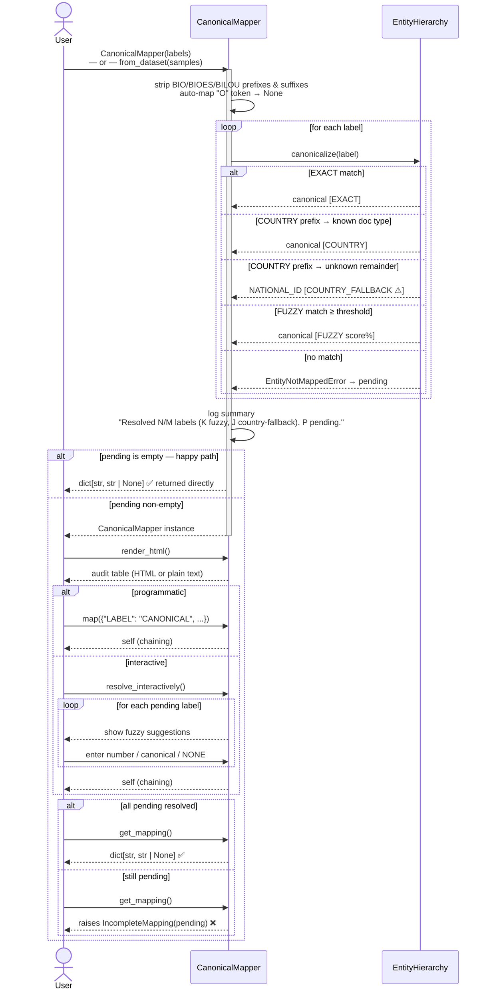

# PRD: Entity Mapping Workflow

## Introduction

Users of Presidio Evaluator bring their own entity label vocabularies — from custom datasets, fine-tuned models, or
third-party tools. Before evaluation can happen, every user-defined label must be resolved to a canonical entity from
the `EntityHierarchy` taxonomy.

This feature provides a single, stateful class — `CanonicalMapper` — for that resolution. The same class is used for
both sides of an evaluation: the dataset's label vocabulary and the model's output label vocabulary. Both are resolved
to canonical entities independently; evaluation then compares canonical-to-canonical.

The workflow:

1. Construct `CanonicalMapper(labels)` — triggers an automatic resolution pass (exact alias, country-prefix, fuzzy).
2. Inspect `mapper.pending` — labels that could not be auto-resolved.
3. Handle pending labels via `mapper.map({...})` (programmatic) or `mapper.resolve_interactively()` (terminal/notebook).
4. Call `mapper.get_mapping()` — returns `dict[str, str | None]`; raises `IncompleteMapping` if any labels are still pending.

The workflow is a pure Python API (no UI). Interactive prompting is done in the terminal (usable in notebooks or CLI),
and can be bypassed entirely by calling `map()` with pre-built assignments.

---

## Workflow Diagram



---

## Goals

- Automatically resolve as many user labels as possible without human intervention.
- Surface unresolvable labels clearly, with ranked fuzzy suggestions to make manual mapping fast.
- Return a single, reusable `dict[str, str | None]` that downstream evaluation code can consume.
- Allow the caller to drive mapping programmatically (batch mode) or interactively (terminal/notebook).
- **Log every resolution decision** so users understand what happened without inspecting internal state.
- Replace the previous semantic-similarity-based mapping approach entirely. All entity resolution goes
  through `EntityHierarchy` canonicalization — no sentence embeddings, no external ML dependencies.

---

## User Stories

### US-001: Auto-resolve known labels
**Description:** As a user, I want all labels that already exist in the hierarchy to be resolved automatically so that I don't have to map them by hand.

**Acceptance Criteria:**
- [ ] Labels that resolve via exact alias-map lookup are mapped without any user interaction.
- [ ] Labels that resolve via fuzzy match (above the default threshold) are also mapped automatically,
      with the resolved canonical and score logged.
- [ ] Labels whose first token is a recognised country code, but whose remainder cannot be matched to any
      known document type, are automatically resolved to `NATIONAL_ID` (country-prefix fallback).
- [ ] When `pending` is empty after construction, `get_mapping()` succeeds immediately.

---

### US-002: Detect and report unresolvable labels
**Description:** As a user, I want the workflow to identify labels it cannot auto-resolve so I know exactly which ones need my attention.

**Acceptance Criteria:**
- [ ] After the auto-resolve pass, labels that could not be resolved are logged at `WARNING` level.
- [ ] `mapper.pending` returns a sorted list of all such labels.
- [ ] If `pending` is empty, no interactive prompting is needed or triggered.

---

### US-003: Interactive mapping for unresolvable labels
**Description:** As a user, I want to be shown ranked suggestions when a label can't be auto-resolved so I can pick the right canonical quickly.

**Acceptance Criteria:**
- [ ] For each pending label, `resolve_interactively()` shows:
  - A warning that no automatic match was found.
  - Up to 5 ranked fuzzy-match candidates (canonical name + similarity score), using
    `difflib.get_close_matches` at a lower threshold (0.40) than auto-resolve.
  - A prompt accepting: a suggestion number, a free-text canonical entity name, or `NONE` to suppress.
- [ ] Re-prompts on invalid input until a valid choice is made.
- [ ] `NONE` maps the label to `None` (suppress from evaluation).
- [ ] `resolve_interactively()` is a no-op when `pending` is empty.

---

### US-004: Programmatic (batch) mapping
**Description:** As a developer or pipeline operator, I want to supply all mappings programmatically so the workflow runs without any interactive prompts.

**Acceptance Criteria:**
- [ ] `mapper.map({"MY_LABEL": "PERSON", "OTHER": None})` assigns canonicals without prompting.
- [ ] `map()` validates all values before applying any (atomic): raises `ValueError` on unknown canonical
      values or labels not in the original input, without partially applying the batch.
- [ ] `map()` can override an already-resolved label (corrects the existing resolution).
- [ ] `map()` returns `self` to allow chaining: `mapper.map({...}).map({...})`.

---

### US-005: Return a complete mapping dict
**Description:** As a user, I want a single dict I can pass to downstream evaluation code.

**Acceptance Criteria:**
- [ ] `get_mapping()` returns `dict[str, str | None]` covering every input label exactly once.
- [ ] Labels mapped to `None` appear in the dict with value `None`.
- [ ] `get_mapping()` raises `IncompleteMapping(pending)` if any labels are still pending.
- [ ] The dict is consumed directly by existing evaluation code without transformation.

---

### US-006: Logging of resolution decisions
**Description:** As a user, I want the workflow to log what it did for each label.

**Acceptance Criteria:**
- [ ] Every resolved label emits a log line at `INFO` level. Examples:
  - `[EXACT]   EMAIL_ADDRESS → EMAIL_ADDRESS`
  - `[EXACT]   B-EMAIL_ADDRESS → EMAIL_ADDRESS  (stripped: B-)`
  - `[FUZZY 87%] EMAILADRES → EMAIL_ADDRESS`
  - `[COUNTRY] GERMAN_PASSPORT_NUMBER → PASSPORT`
  - `[COUNTRY-FALLBACK] NIGERIA_UNICORN_CARD → NATIONAL_ID  ⚠ document type not recognised`
  - `[MANUAL]  MY_UNKNOWN_LABEL → GOVERNMENT_ID`
  - `[NONE]    O → None  (outside token)`
  - `[NONE]    EXTRA_LABEL → None  (suppressed from evaluation)`
- [ ] Country-prefix fallback emits at `WARNING` level (assumption was made).
- [ ] Unresolvable labels emit at `WARNING`: `[UNRESOLVED] {label}  — no automatic match found`
- [ ] After the auto-resolve pass, a summary `INFO` line is logged:
  `Resolved N/M labels automatically (K fuzzy, J country-fallback). P require manual mapping.`
- [ ] Logger name is `presidio_evaluator.entity_mapping`.
- [ ] No output when the root logger has no handlers (standard Python behaviour).

---

### US-007: Visual HTML audit table
**Description:** As a user, I want to call `render_html()` on the mapper to see a styled table of all labels, their resolution tier, canonical target, and score.

**Acceptance Criteria:**
- [ ] `mapper.render_html()` renders an HTML table via `IPython.display.HTML` in Jupyter; falls back to
      plain-text in non-Jupyter environments (never raises).
- [ ] Columns: Raw Label | Tier badge | Canonical | Score.
- [ ] Row sort order: `PENDING` → `COUNTRY_FALLBACK` → `FUZZY` → `EXACT`/`COUNTRY`/`MANUAL` → `NONE`.
- [ ] Tier badge colours: `EXACT`/`COUNTRY` = green, `FUZZY` = amber, `COUNTRY_FALLBACK` = amber + ⚠,
      `MANUAL` = blue, `NONE` = grey, `PENDING` = red.
- [ ] A summary bar above the table shows counts per tier.
- [ ] Fully self-contained HTML (inline styles, no external CSS/JS).
- [ ] Can be called at any point — before, during, or after resolution — to reflect current state.

---

## Codebase Structure

### Files to create
- `presidio_evaluator/entity_mapping/mapper.py` — `EntityMapper` Protocol + `CanonicalMapper` class + `IncompleteMapping` exception.

### Files to remove
- `presidio_evaluator/entity_mapping/interactive.py` — deleted; `CanonicalMapper` replaces the interactive workflow.
- The previous `mapper.py` content (`SemanticEntityMapper`, `create_presidio_mapper`, `create_hierarchical_mapper`, `suggest_mapping`) is removed entirely.

### Tests to remove
- `tests/test_interactive_mapping.py` — tests for `EntityMappingHelper` and `SemanticEntityMapper`.

### Tests to create
- `tests/test_canonical_mapper.py` — full coverage of `CanonicalMapper`.

### Dependencies to remove
- `sentence-transformers` — no longer used; remove from `pyproject.toml`.

### `__init__.py` changes
The public surface of `presidio_evaluator.entity_mapping` becomes:
```python
from presidio_evaluator.entity_mapping import (
    CanonicalMapper,             # primary mapping class
    EntityMapper,                # Protocol
    IncompleteMapping,           # exception
    # hierarchy re-exports (unchanged)
    EntityHierarchy, EntityNotMappedError, ALL_CANONICAL_ENTITIES, ...
)
```

---

## Public API

```python
# --- mapper.py ---

class CanonicalMapper:
    def __init__(
        self,
        labels: list[str] | set[str],
        hierarchy: EntityHierarchy | None = None,   # defaults to EntityHierarchy.default()
        fuzzy_threshold: float = 0.80,
    ) -> None: ...

    @classmethod
    def from_dataset(
        cls, samples: list[InputSample], **kwargs
    ) -> "dict[str, str | None] | CanonicalMapper": ...
    # Returns dict directly if all labels auto-resolve (pending is empty).
    # Returns CanonicalMapper instance if any labels are pending.
    # Extracts unique entity labels from InputSample spans.

    @property
    def pending(self) -> list[str]: ...               # sorted; empty when complete

    def map(self, mappings: dict[str, str | None]) -> "CanonicalMapper": ...
    def resolve_interactively(self, prompt_fn=input) -> "CanonicalMapper": ...
    def get_mapping(self) -> dict[str, str | None]: ...   # raises IncompleteMapping if pending
    def render_html(self) -> None: ...
```

Resolution tiers (in order, first match wins):
1. **EXACT** — normalised alias-map lookup
2. **COUNTRY** — country-prefix, remainder resolves to a known document type
3. **COUNTRY_FALLBACK** — country-prefix, remainder unknown → `NATIONAL_ID`
4. **FUZZY** — difflib fuzzy match ≥ `fuzzy_threshold` against alias map
5. **PENDING** — none of the above; user must act via `map()` or `resolve_interactively()`

After `map()` or `resolve_interactively()`:
- **MANUAL** — user-supplied canonical
- **NONE** — user suppressed evaluation for this label

### Typical usage
```python
# Happy path — everything auto-resolves, mapping returned immediately
mapping = CanonicalMapper.from_dataset(samples)
# mapping is a dict[str, str | None] — ready to pass to evaluation

# Direct construction from a known label list
mapper = CanonicalMapper(["PERSON", "EMAIL_ADDRESS", "MY_CUSTOM_LABEL"])
# isinstance(mapper, CanonicalMapper) → True when pending is non-empty

mapper.render_html()            # audit auto-resolved state, spot pending labels
mapper.resolve_interactively()  # terminal prompts for each pending label
mapping = mapper.get_mapping()  # raises IncompleteMapping if still pending

# Programmatic (batch) override
mapper = CanonicalMapper.from_dataset(samples)
mapper.map({"MY_CUSTOM_LABEL": "PERSON", "INTERNAL_ID": None})
mapping = mapper.get_mapping()
```

---

## Functional Requirements

- **FR-1:** Accept `list[str]` or `set[str]` of raw labels; deduplicate before processing.
- **FR-1b:** Before any resolution, normalize each label by stripping BIO/BIOES/BILOU/BILUO tagging
  scheme prefixes and suffixes:
  - **Prefixes:** `B-`, `I-`, `O-`, `E-`, `L-`, `S-`, `U-` (case-insensitive).
  - **Suffixes:** `-B`, `-I`, `-O`, `-E`, `-L`, `-S`, `-U` (case-insensitive).
  - Examples: `B-PERSON` → `PERSON`, `PERSON-I` → `PERSON`, `I-EMAIL_ADDRESS` → `EMAIL_ADDRESS`.
  - The special outside token `O` (exactly, after stripping) is automatically mapped to `None`
    (suppressed from evaluation) without entering the resolution pipeline and without prompting.
  - Normalization is transparent: the *original* label (before stripping) is used as the dict key in
    `get_mapping()` and in all log messages; the stripped form is only used internally for lookup.
  - Only well-formed prefixes/suffixes are stripped (e.g. `B-PERSON` → `PERSON`);
    labels that merely start with a `B` are not affected (e.g. `BANK_ACCOUNT` is unchanged).
- **FR-2:** Run the auto-resolve pass at construction time. Tier order: EXACT → COUNTRY → COUNTRY_FALLBACK → FUZZY.
- **FR-3:** Labels that fail all tiers go to `pending`. `pending` is sorted alphabetically.
- **FR-4:** `map()` validates all entries atomically before applying any. Raises `ValueError` on:
  - Label not in the original input.
  - Canonical value not in `ALL_CANONICAL_ENTITIES` (and not `None`).
- **FR-5:** `resolve_interactively()` shows up to 5 fuzzy suggestions at cutoff 0.40 (lower than auto-resolve),
  accepts a number, free-text canonical, or `NONE`. Re-prompts on invalid input. `prompt_fn` is injectable.
- **FR-6:** `get_mapping()` raises `IncompleteMapping(pending)` if `pending` is non-empty.
- **FR-7:** `render_html()` uses `IPython.display.HTML` when available; falls back to `print()`. Never raises.
- **FR-8:** Logging uses `presidio_evaluator.entity_mapping` logger. See US-006 for log formats and levels.
- **FR-9:** `CanonicalMapper.from_dataset(samples, **kwargs)` extracts unique entity labels from
  `InputSample.spans[*].entity_type` and delegates to `__init__`. If `pending` is empty after
  construction, returns `get_mapping()` directly (a `dict`); otherwise returns the `CanonicalMapper`
  instance. `**kwargs` are passed through (`hierarchy`, `fuzzy_threshold`).

---

## Acceptance Criteria

### Correctness
- [ ] All resolution tiers (EXACT, COUNTRY, COUNTRY_FALLBACK, FUZZY) resolve without user interaction.
- [ ] `pending` contains exactly the labels that failed all tiers.
- [ ] `map()` is atomic: a batch with one invalid entry applies nothing.
- [ ] `get_mapping()` raises `IncompleteMapping` when pending is non-empty; succeeds otherwise.
- [ ] `None`-mapped labels appear in `get_mapping()` with value `None`.
- [ ] Input deduplication: a label appearing twice is resolved once.

### Testing
- [ ] Unit tests in `tests/test_canonical_mapper.py` cover:
  - `from_dataset()` — extracts unique span entity types from `InputSample` list
  - Construction and auto-resolve (each tier independently)
  - BIO/BIOES/BILOU prefix stripping (`B-PERSON` → resolves as `PERSON`; key in dict is `B-PERSON`)
  - Suffix stripping (`PERSON-I` → resolves as `PERSON`)
  - `O` token auto-mapped to `None` without prompting
  - Non-scheme labels starting with `B` are not stripped (`BANK_ACCOUNT` unchanged)
  - `pending` content and ordering
  - `map()` — happy path, single and batch
  - `map()` — invalid label raises `ValueError` (no partial apply)
  - `map()` — invalid canonical raises `ValueError` (no partial apply)
  - `map()` — override of already-resolved label
  - `get_mapping()` — raises `IncompleteMapping` when pending non-empty
  - `get_mapping()` — returns correct dict when complete
  - `resolve_interactively()` — number selection, `NONE` keyword, free-text, re-prompt on invalid
  - `resolve_interactively()` — no-op when pending is empty
  - `render_html()` — does not raise when IPython unavailable
  - `CanonicalMapper` satisfies `EntityMapper` Protocol (`isinstance` check)
  - `IncompleteMapping` stores pending list and includes count in message
- [ ] All tests are non-interactive (use `prompt_fn` injection; no monkey-patching of builtins).
- [ ] Test suite passes with `pytest` and no warnings.

### Lint & style
- [ ] `ruff check` passes with zero errors on all changed files.
- [ ] No unused imports remain in any changed file.

### Documentation
- [ ] `CanonicalMapper` class docstring explains the resolution tiers and typical usage.
- [ ] Each public method/property has a one-line docstring.
- [ ] `EntityMapper` Protocol docstring describes the contract.
- [ ] `IncompleteMapping` docstring explains when it is raised and that `.pending` contains the offending labels.

---

## Non-Goals

- No GUI or web interface — terminal prompts only.
- No persistence of mappings to disk (callers can serialize `get_mapping()` themselves).
- No changes to `EntityHierarchy` internals or the `HIERARCHY` dict.
- No automatic suggestion of adding new entities to the hierarchy.
- No semantic/embedding-based similarity (sentence-transformers removed entirely).
- No model label extraction utilities — extracting labels from Presidio or HuggingFace models is deferred to a follow-up PRD.

---

## Open Questions

1. ~~**Label extraction utilities**~~ — **Deferred.** `LabelExtractor` ABC + `PresidioLabelExtractor` +
   `HuggingFaceLabelExtractor` will be addressed in a follow-up PRD. For now, callers pass labels
   directly via `CanonicalMapper(labels)` or extract them from datasets via `CanonicalMapper.from_dataset()`.

2. ~~**Strict mode**~~ — **Closed (not needed).** `get_mapping()` already raises `IncompleteMapping`
   if `pending` is non-empty. No additional `strict` flag warranted.

3. ~~**Full canonical list in interactive prompt**~~ — **Closed.** 5 fuzzy suggestions + free-text
   input (validated against `ALL_CANONICAL_ENTITIES`) is sufficient. A numbered list of 100+ entities
   adds noise without helping.
